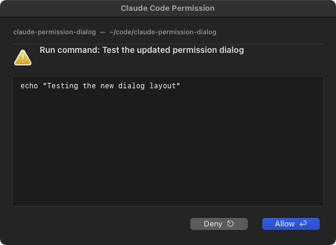

# Claude Code Permission Dialog

A macOS native dialog that replaces Claude Code's terminal permission prompts. The dialog floats above all windows on all desktops, so you can approve or deny tool calls without switching to your terminal.

**Enter** = Allow | **Escape** = Deny

## How it works

Claude Code has a [hooks system](https://docs.anthropic.com/en/docs/claude-code/hooks) that can intercept tool calls before they execute. This project installs a `PreToolUse` hook that:

1. Receives the tool call details (tool name, parameters) as JSON
2. Formats a human-readable summary
3. Displays a native macOS floating dialog (compiled Swift, no dock icon)
4. Returns `permissionDecision: "allow"` or `"deny"` based on your choice

The hook's `permissionDecision` response bypasses the built-in terminal prompt entirely.

## Requirements

- macOS
- [jq](https://jqlang.github.io/jq/) (`brew install jq`)
- Xcode Command Line Tools (`xcode-select --install`)

## Install

```bash
git clone <this-repo>
cd claude-permission-dialog
./install.sh
```

Then restart Claude Code.

## Uninstall

```bash
./uninstall.sh
```

## Configuration

The installer adds a hook entry to `~/.claude/settings.json`. You can edit the `matcher` regex to control which tools trigger the dialog:

| Matcher | Effect |
|---------|--------|
| `".*"` | All tools (default) |
| `"Bash\|Edit\|Write"` | Only mutating file/shell tools |
| `"Bash\|Edit\|Write\|mcp__.*"` | Mutating + MCP server tools |
| `"Bash"` | Only shell commands |

Example settings entry:

```json
{
  "hooks": {
    "PreToolUse": [
      {
        "matcher": "Bash|Edit|Write",
        "hooks": [
          {
            "type": "command",
            "command": "~/.claude/hooks/permission-dialog.sh",
            "timeout": 130,
            "statusMessage": "Waiting for permission dialog..."
          }
        ]
      }
    ]
  }
}
```

## Project structure

```
claude-permission-dialog/
├── src/
│   ├── PermissionDialog.swift   # Native macOS dialog app
│   └── hook.sh                  # PreToolUse hook script
├── install.sh                   # Compile + install + configure
├── uninstall.sh                 # Clean removal
└── README.md
```

## License

MIT
